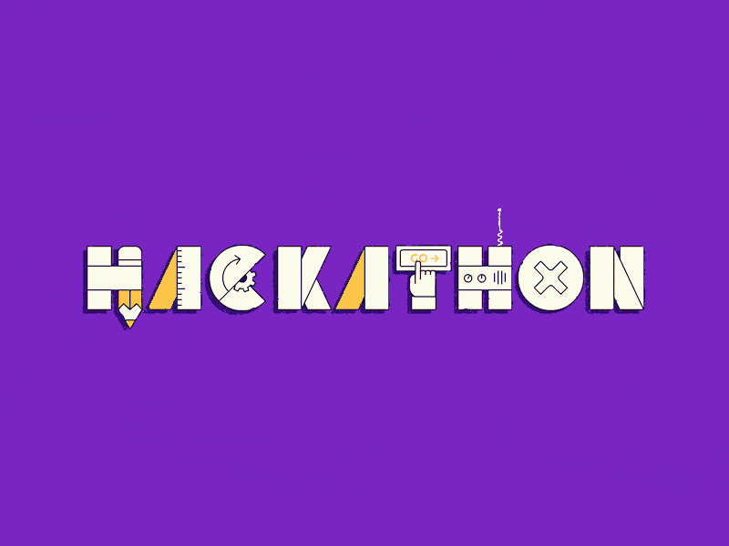

<p align="center">
    
</p>

# **CODE CAMP 2020** 

This repository contains the **CODE CAMP 2020** Registeration files. By issuing a pull request to this repository, you can request to register to the **CODE CAMP 2020**.

Join the event and receive Certificate 📜 and cash-prizes 💰 in the comfort of your home!


# **Privacy Notice** 👀

Consider that all the information that you add to this repository will be publicly available.

- Kindly fill your Full Name. No Nicknames and Avatars required.
- You Need to Give your teammates profile picture in this repository. Profile picture would be used at the time of result declaration.


# **Prizes** 🏆-->👕-->📜-->💸

Everyone participating in this hackathon will get a certificate by Government aided society **I.S.T.E**. Make sure you submit your pull request before midnight, <`date-will-we-provided-shortly`>.

- 🏆 **1st Prize** 🥇 : **`Cool winner's T-Shirts`**. and **`5K 💰 cash Prize`**. 

- 🏆 **2nd Prize** 🥈 : **`3k 💸`**  to the runner-up with a **`certificate 📜`**
- 🏆 **3rd Prize** 🥉 : **`2k 💸`** with a **`certificate 📜`**

# **Who can apply** 📝

Any Student | graduates | Open-Source teams who loves to code 👨‍💻 are welcome. 🙏

- Open-source Teams
- High School Graduates
- College Graduates
- Anyone who loves to code 👨‍💻.

# How to Register for **`CODE CAMP 2020`** ❓ 

<!-- Replace `<Your-Team-Name>` with your GitHub username in this guide. -->

### 1. Create the folder _data/Team-Name/ 

- Fork this repository, Star it ⭐.
- Copy the duplicate folder inside the `_data` folder.
- And now replace the copied folder with your Team-Name. It should look something like this `_data/<YOUR-Team-Name>/`. Ex.

> **Note :** The file structure should match the following file structure example. 👇👇 

```
_data/<Team-Name-for-folder>/index.md
```

### 2. Add your team-mates profile picture to the folder

Enter the folder you just created and add a profile picture of your choice. Accepted files are **png** and **jpg**, should be squared and minimum size 544x544 pixels. Ex.


```
|---_data
      |---folder(with-your-team-name)
            |----member-1-name.png
            |----member-2-name.png
            |----member-3-name.png
            |----member-4-name.png
            |----<Team-Name>.md
```

_Be aware, this pictures will be displayed if your team is in the Top three_

### 3. Add your profile information

- Add your Complete Details as asked in the markdown template. i.e `your-team-Name.md` file.
- Ensure that details filled are not fake.
- When you completely filled your details. Re-check for Typos if any.

* **Do not manipulate the template files As per your methodology.** 
* **Do not use special characters in the template above.**

# **Wait, I have more questions to ask** ⁉

  > Don't worry we members of **I.S.T.E** are here to help You.

- Some of your Common queries are answered here [My Common Queries](https://github.com/ISTESRMNCR)

- If you have more Question and Not getting something. Please Raise your Issue HERE 👉 [ISSUES FOR CODE-CAMPERS-2020](https://github.com/ISTESRMNCR/)

# **Event's Complete Timeline** 🕖

- Visit Complete event timeline [HERE](Time-Line-Link-Goes-Here)

# The Hack Day 👨‍💻

Don't forget to Register By issuing the Pull Request. 

- 📆 <`Date-time-First-Pr`>(PULL REQUEST-1)
- 📆 <`Date-time-Second-Pr`>(PULL REQUEST-2)
- ⏰ <`Time`>
- 📎 Add the [Link that will be provided shortly](Google-Calend_link) to your calendar.
